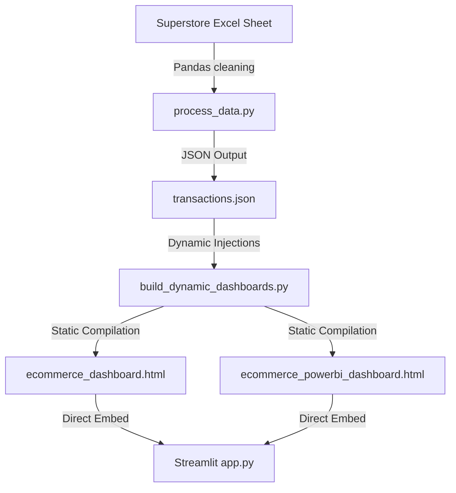

# 🛒 E-Commerce Sales Analytics Portal

<div align="center">

<!-- Cyberpunk Glowing Animated Header -->
<a href="https://git.io/typing-svg">
  
</a>

<br>

<!-- Cyberpunk Animated Hero Banner -->
<p align="center">
  
</p>

<br>

<!-- Modern Cyberpunk Badges -->
[](https://e-commerce-dashboardgit-qd3gjlse3fsulugafbvx5c.streamlit.app/)
[](https://shivam09xc.github.io/E-Commerce-Dashboard/)
[](https://www.python.org/)

<br>

<!-- Repository Views Badge -->


<br>

📊 **Superstore Dataset · 3,500 Transactions · Interactive Analytics & Corporate Visualizations** 📈

[🌐 Live Streamlit App](https://e-commerce-dashboardgit-qd3gjlse3fsulugafbvx5c.streamlit.app/) | [🎨 Live Static Portal](https://shivam09xc.github.io/E-Commerce-Dashboard/)

</div>

---

<!-- Cyberpunk Divider -->


## 🌌 Overview & Cybernetic Command
<div style="background-color: #0b111e; border: 1px solid #1e2d4a; border-radius: 16px; padding: 28px; box-shadow: 0 8px 32px 0 rgba(0, 247, 255, 0.12); margin: 20px 0;">
  <p style="color: #94a3b8; font-family: 'Inter', sans-serif; line-height: 1.7; font-size: 14.5px; margin: 0;">
    Welcome to a top-tier <strong>E-Commerce Analytics Dashboard Command Center</strong>. This workspace bridges the gap between client-side responsive web dashboards and classic enterprise reporting. Powered by a high-octane Python analytical engine, it transforms static transactional records into beautifully styled graphical canvases. Choose your analytical dimension—whether the glowing neon Command Center or the structured Power BI Workspace—to reveal deep transactional matrices.
  </p>
</div>

---

<!-- Cyberpunk Divider -->


## 🚀 Interactive Portal Dimensions

<div align="center">
<table border="0">
  <tr>
    <td width="50%" valign="top">
      <div style="background: #0d1222; border: 1.5px solid #00F7FF; border-radius: 12px; padding: 24px; min-height: 310px; box-shadow: 0 4px 25px rgba(0, 247, 255, 0.15); margin: 10px;">
        <div align="center">
          <h3 style="color: #00F7FF; font-family: 'Space Grotesk', sans-serif;">🌌 COMMAND CENTER</h3>
          <span style="font-size: 10px; padding: 2px 8px; border-radius: 4px; background: rgba(0,247,255,0.15); color: #00F7FF; font-weight: bold; border: 0.5px solid #00F7FF;">DARK NEON</span>
        </div>
        <br>
        <p style="color: #94a3b8; font-size: 13px; line-height: 1.6; text-align: left;">A glassmorphic command deck designed for rapid overview, trend analysis, and interactive visual queries.</p>
        <ul style="color: #cbd5e1; font-size: 12px; margin-top: 12px; line-height: 1.6; text-align: left; padding-left: 20px;">
          <li>⚡ Interactive JavaScript multiselect slicers</li>
          <li>🎯 Smooth tooltip overlays and glowing cards</li>
          <li>📈 Built-in 3-month moving average forecasting</li>
        </ul>
        <br>
        <div align="center">
          <a href="https://shivam09xc.github.io/E-Commerce-Dashboard/ecommerce_dashboard.html" style="background: rgba(0, 247, 255, 0.15); color: #00F7FF; padding: 8px 16px; border: 1.5px solid #00F7FF; border-radius: 6px; text-decoration: none; font-weight: bold; font-size: 12px; box-shadow: 0 0 10px rgba(0,247,255,0.3);">LAUNCH COMMAND CENTER</a>
        </div>
      </div>
    </td>
    <td width="50%" valign="top">
      <div style="background: #0d1222; border: 1.5px solid #fbbf24; border-radius: 12px; padding: 24px; min-height: 310px; box-shadow: 0 4px 25px rgba(251, 191, 36, 0.15); margin: 10px;">
        <div align="center">
          <h3 style="color: #fbbf24; font-family: 'Space Grotesk', sans-serif;">💼 BI WORKSPACE</h3>
          <span style="font-size: 10px; padding: 2px 8px; border-radius: 4px; background: rgba(251,191,36,0.15); color: #fbbf24; font-weight: bold; border: 0.5px solid #fbbf24;">POWER BI STYLE</span>
        </div>
        <br>
        <p style="color: #94a3b8; font-size: 13px; line-height: 1.6; text-align: left;">A clean, corporate business intelligence layout matching Microsoft Power BI Desktop design guidelines.</p>
        <ul style="color: #cbd5e1; font-size: 12px; margin-top: 12px; line-height: 1.6; text-align: left; padding-left: 20px;">
          <li>🏢 Power BI style cards & growth delta indicators</li>
          <li>📍 Highly organized regional table matrix layout</li>
          <li>📌 Regional filter drill-through capabilities</li>
        </ul>
        <br>
        <div align="center">
          <a href="https://shivam09xc.github.io/E-Commerce-Dashboard/ecommerce_powerbi_dashboard.html" style="background: rgba(251, 191, 36, 0.15); color: #fbbf24; padding: 8px 16px; border: 1.5px solid #fbbf24; border-radius: 6px; text-decoration: none; font-weight: bold; font-size: 12px; box-shadow: 0 0 10px rgba(251,191,36,0.3);">LAUNCH WORKSPACE</a>
        </div>
      </div>
    </td>
  </tr>
</table>
</div>

---

<!-- Cyberpunk Divider -->


## 🛠️ Cybernetic Tech Stack

<div align="center">

| Core Environment | Interactive Libraries | Style Customizations | Data Pipelines |
| :---: | :---: | :---: | :---: |
|  |  |  |  |
|  |  |  |  |

</div>

---

<!-- Cyberpunk Divider -->


## 📈 Analytical Pipeline & Execution



### 🧠 Slicer cross-filtering
Dynamic slicing controls process and filter datasets recursively. Selecting filters dynamically refreshes KPI delta indicators, doughnut splits, and products ranking instantly.

### 🔮 Predictive Moving Averages
Visualizes historical transactional volumes alongside 3-month moving average curves to forecast incoming business quarters.

---

<!-- Cyberpunk Divider -->


## ⚙️ Local Configuration Guide

To deploy the dashboard workspace on your local environment:

### 1️⃣ Clone the repository
```bash
git clone https://github.com/Shivam09xc/E-Commerce-Dashboard.git
cd E-Commerce-Dashboard
```

### 2️⃣ Install required modules
```bash
pip install -r requirements.txt
```

### 3️⃣ Launch Streamlit Dashboard
```bash
python -m streamlit run app.py
```
This starts the local portal server and launches your browser at `http://localhost:8501`.

---

<!-- Cyberpunk Divider -->


## 🔄 Dynamic Database Rebuilding
If you modify or update the transactional rows inside `ecommerce_analytics (1).xlsx`, run the preprocessing pipeline to compile fresh assets:

```bash
# 1. Clean raw Excel records and output transactions.json
python process_data.py

# 2. Inject updated JSON and compile fresh dashboards
python build_dynamic_dashboards.py
```

---

<!-- Cyberpunk Divider -->


## ☁️ Deployment Pipeline Guide

### 🌐 GitHub Pages Deployment (Free Web Hosting)
1. Navigate to **Settings** > **Pages** inside your repository.
2. Under "Build and deployment", set **Source** to `Deploy from a branch`.
3. Set **Branch** to `main` and Folder to `/ (root)`.
4. Click **Save**. The portal is live at: `https://shivam09xc.github.io/E-Commerce-Dashboard/`

### ☁️ Streamlit Cloud Deployment (Free Interactive App Hosting)
1. Sign in to [share.streamlit.io](https://share.streamlit.io) via GitHub.
2. Select your repository `Shivam09xc/E-Commerce-Dashboard`.
3. Set the Main File path to `app.py` and click **Deploy**.
4. Access the live dashboard at: [https://e-commerce-dashboardgit-qd3gjlse3fsulugafbvx5c.streamlit.app/](https://e-commerce-dashboardgit-qd3gjlse3fsulugafbvx5c.streamlit.app/)

---

<!-- Cyberpunk Divider -->


## 🐍 contribution snake automation

This repository utilizes an automated GitHub Action workflow (`snake.yml`) to generate a cybernetic contribution snake every 12 hours:

<div align="center">
  
</div>

---

<!-- Cyberpunk Divider -->


## 📈 Developer Core Analytics

<div align="center">
  
  
</div>

<br>

<div align="center">
  
</div>

---

<!-- Cyberpunk Divider -->


## 🔮 Roadmap & Future Enhancements
*   [ ] **Machine Learning Models:** Replacing moving averages with neural forecasting models (ARIMA / LSTM).
*   [ ] **PostgreSQL Connector:** Replacing local Excel pipelines with active database instances.
*   [ ] **Auto-Reporting Engine:** Automatic daily PDF summary compilation and email alerts.
*   [ ] **Security Gateway:** Multi-tenant dashboard configurations with secure OAuth.

---

<!-- Cyberpunk Divider -->


<div align="center">

# 💙 Crafted with Passion by Shivam Soni

<br>


<br>
<br>

### ⭐ If you like this project, support it by giving it a star!

<!-- Cyberpunk Wave Footer -->


</div>
