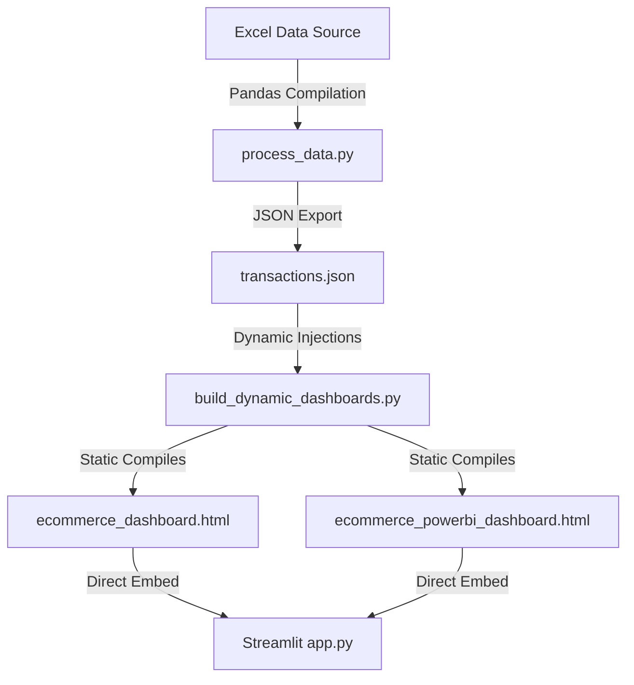

<!-- Cyberpunk Header Banner -->
<p align="center">
  
</p>

<div align="center">

<!-- Cyberpunk Glowing Animated Header Typing -->
<a href="https://git.io/typing-svg">
  
</a>

<br>

<!-- Premium Social Badges Grid -->
[](https://e-commerce-dashboardgit-qd3gjlse3fsulugafbvx5c.streamlit.app/)
[](https://shivam09xc.github.io/E-Commerce-Dashboard/)
[](https://www.python.org/)

<br>

[](https://github.com/Shivam09xc/E-Commerce-Dashboard/stargazers)
[](https://github.com/Shivam09xc/E-Commerce-Dashboard/network/members)


<br>

📊 **Superstore Dataset · 3,500 Transactions · Dynamic Web Dashboards & Business Analytics** 📈

[🌐 Live Streamlit App](https://e-commerce-dashboardgit-qd3gjlse3fsulugafbvx5c.streamlit.app/) | [🎨 Live Static Portal](https://shivam09xc.github.io/E-Commerce-Dashboard/)

---

<!-- Cyberpunk Glowing Separator -->


</div>

---

## ⚡ System Command Overview

<div style="background-color: #0b111e; border: 1.5px solid #1e2d4a; border-radius: 16px; padding: 28px; box-shadow: 0 8px 32px 0 rgba(0, 247, 255, 0.15); margin: 20px 0;">
  <p style="color: #94a3b8; font-family: 'Inter', sans-serif; line-height: 1.8; font-size: 14.5px; margin: 0;">
    Welcome to the <strong>E-Commerce Sales Command Center</strong>. This unified intelligence hub consolidates client-side custom dashboards and enterprise reporting panels. Driven by a high-octane Python data compiler, the platform extracts complex commercial records (3,500 transactions) into stunning analytical canvases. Sift through variables, view growth patterns, and inspect margins dynamically across two custom-styled views.
  </p>
</div>

---

## 🎨 Dual-Visual Command Decks

<div align="center">
<table border="0" cellpadding="10" cellspacing="10">
  <tr>
    <td width="50%" valign="top">
      <div style="background: #0d1222; border: 2px solid #00F7FF; border-radius: 16px; padding: 26px; min-height: 330px; box-shadow: 0 4px 30px rgba(0, 247, 255, 0.2); margin: 10px; text-align: left;">
        <div align="center">
          <h3 style="color: #00F7FF; font-family: 'Space Grotesk', sans-serif; font-size: 20px; letter-spacing: 0.5px;">🌌 DARK NEON PORTAL</h3>
          <span style="font-size: 10px; padding: 3px 10px; border-radius: 20px; background: rgba(0,247,255,0.15); color: #00F7FF; font-weight: bold; border: 1px solid #00F7FF; text-transform: uppercase; letter-spacing: 0.5px;">Glassmorphism UI</span>
        </div>
        <br>
        <p style="color: #94a3b8; font-size: 13px; line-height: 1.6;">A modern dark command deck tailored for real-time overview and analytical data discovery.</p>
        <ul style="color: #cbd5e1; font-size: 12px; margin-top: 14px; line-height: 1.7; padding-left: 15px;">
          <li>🔒 Fully reactive JavaScript slicer grids</li>
          <li>📊 3-month moving average forecasting lines</li>
          <li>🚀 Lightweight Chart.js rendering engines</li>
        </ul>
        <br>
        <div align="center">
          <a href="https://shivam09xc.github.io/E-Commerce-Dashboard/ecommerce_dashboard.html" style="background: rgba(0, 247, 255, 0.2); color: #00F7FF; padding: 10px 20px; border: 1.5px solid #00F7FF; border-radius: 8px; text-decoration: none; font-weight: bold; font-size: 12px; box-shadow: 0 0 15px rgba(0,247,255,0.4); text-transform: uppercase; letter-spacing: 0.5px;">Launch Deck</a>
        </div>
      </div>
    </td>
    <td width="50%" valign="top">
      <div style="background: #0d1222; border: 2px solid #fbbf24; border-radius: 16px; padding: 26px; min-height: 330px; box-shadow: 0 4px 30px rgba(251, 191, 36, 0.2); margin: 10px; text-align: left;">
        <div align="center">
          <h3 style="color: #fbbf24; font-family: 'Space Grotesk', sans-serif; font-size: 20px; letter-spacing: 0.5px;">💼 BI WORKSPACE</h3>
          <span style="font-size: 10px; padding: 3px 10px; border-radius: 20px; background: rgba(251,191,36,0.15); color: #fbbf24; font-weight: bold; border: 1px solid #fbbf24; text-transform: uppercase; letter-spacing: 0.5px;">Corporate Report</span>
        </div>
        <br>
        <p style="color: #94a3b8; font-size: 13px; line-height: 1.6;">A bright, clean interface structured according to official Power BI visual report layouts.</p>
        <ul style="color: #cbd5e1; font-size: 12px; margin-top: 14px; line-height: 1.7; padding-left: 15px;">
          <li>🏢 Power BI style cards & growth metrics</li>
          <li>📍 Advanced regional grid matrices</li>
          <li>📌 Slicer chip region drill-throughs</li>
        </ul>
        <br>
        <div align="center">
          <a href="https://shivam09xc.github.io/E-Commerce-Dashboard/ecommerce_powerbi_dashboard.html" style="background: rgba(251, 191, 36, 0.15); color: #fbbf24; padding: 10px 20px; border: 1.5px solid #fbbf24; border-radius: 8px; text-decoration: none; font-weight: bold; font-size: 12px; box-shadow: 0 0 15px rgba(251,191,36,0.4); text-transform: uppercase; letter-spacing: 0.5px;">Launch Workspace</a>
        </div>
      </div>
    </td>
  </tr>
</table>
</div>

---

<!-- Cyberpunk Divider -->


## 🛠️ Cybernetic Tech Stack

<div align="center">

| Core Language | Framework | Custom Styling | Analytics |
| :---: | :---: | :---: | :---: |
|  |  |  |  |
|  |  |  |  |

</div>

---

<!-- Cyberpunk Divider -->


## 🔄 Automated Data Pipeline



### 🧠 Recursive cross-filtering
Fully responsive JavaScript controllers filter transaction lists recursively. Selecting key segments instantly recalculates visual graphs, metrics, and categories dynamically.

### 🔮 Predictive Moving Averages
Appends a 3-month moving average calculation alongside historical figures to visualize upcoming business trends.

---

<!-- Cyberpunk Divider -->


## ⚙️ Local Configuration Guide

To deploy the dashboard portal on your local system:

### 1️⃣ Clone the Repository
```bash
git clone https://github.com/Shivam09xc/E-Commerce-Dashboard.git
cd E-Commerce-Dashboard
```

### 2️⃣ Install Required Modules
```bash
pip install -r requirements.txt
```

### 3️⃣ Launch Streamlit Dashboard
```bash
python -m streamlit run app.py
```
Streamlit starts the web portal locally and opens your browser at `http://localhost:8501`.

---

<!-- Cyberpunk Divider -->


## 🔄 Preprocessing Database Pipeline
If you update or modify raw transaction records inside `ecommerce_analytics (1).xlsx`, run the automated pipeline to compile fresh assets:

```bash
# 1. Process Excel rows into transactions.json
python process_data.py

# 2. Inject updated JSON and compile HTML dashboards
python build_dynamic_dashboards.py
```

---

<!-- Cyberpunk Divider -->


## ☁️ Deployment Pipeline Guide

### 🌐 GitHub Pages Deployment (Free Web Hosting)
1. Go to **Settings** > **Pages** inside your repository.
2. Under "Build and deployment", set **Source** to `Deploy from a branch`.
3. Set **Branch** to `main` and Folder to `/ (root)`.
4. Click **Save**. The portal is live at: `https://shivam09xc.github.io/E-Commerce-Dashboard/`

### ☁️ Streamlit Cloud Deployment (Free App Hosting)
1. Sign in to [share.streamlit.io](https://share.streamlit.io) via GitHub.
2. Select your repository `Shivam09xc/E-Commerce-Dashboard`.
3. Set the Main File path to `app.py` and click **Deploy**.
4. Access the live dashboard at: [https://e-commerce-dashboardgit-qd3gjlse3fsulugafbvx5c.streamlit.app/](https://e-commerce-dashboardgit-qd3gjlse3fsulugafbvx5c.streamlit.app/)

---

<!-- Cyberpunk Divider -->


## 🐍 Contribution Snake Automation

This repository utilizes an automated GitHub Action workflow (`snake.yml`) with write permissions configured. Every 12 hours, the workflow generates a glowing cybernetic contribution snake SVG:

<div align="center">
  <!-- Glowing Frame wrapping the Snake animation -->
  <div style="padding: 10px; background: #0b111e; border: 1.5px solid #00F7FF; border-radius: 12px; box-shadow: 0 0 15px rgba(0, 247, 255, 0.25);">
    <picture>
      <source media="(prefers-color-scheme: dark)" srcset="https://raw.githubusercontent.com/Shivam09xc/Shivam09xc/output/snake.svg">
      <source media="(prefers-color-scheme: light)" srcset="https://raw.githubusercontent.com/Shivam09xc/Shivam09xc/output/snake.svg">
      
    </picture>
  </div>
</div>

---

<!-- Cyberpunk Divider -->


## 📈 Developer Core Analytics

<div align="center">
  
  
</div>

<br>

<div align="center">
  
</div>

---

<!-- Cyberpunk Divider -->


## 🔮 Roadmap & Future Enhancements
*   [ ] **Machine Learning Models:** Replacing moving averages with neural forecasting models (ARIMA / LSTM).
*   [ ] **PostgreSQL Connector:** Replacing local Excel pipelines with active database instances.
*   [ ] **Auto-Reporting Engine:** Automatic daily PDF summary compilation and email alerts.
*   [ ] **Security Gateway:** Multi-tenant dashboard configurations with secure OAuth.

---

<!-- Cyberpunk Divider -->


<div align="center">

# 💙 Crafted with Passion by Shivam Soni

<br>


<br>
<br>

### ⭐ If you like this project, support it by giving it a star!

<!-- Cyberpunk Wavy Gradient Footer -->


</div>
