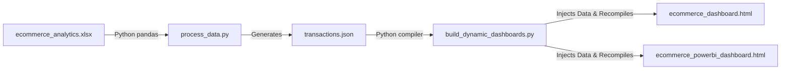

# 🛒 E-Commerce Sales Analytics Portal

<div align="center">

[](https://e-commerce-dashboardgit-qd3gjlse3fsulugafbvx5c.streamlit.app/)
[](https://shivam09xc.github.io/E-Commerce-Dashboard/)
[](https://www.python.org/)

📊 **Superstore Dataset · 3,500 Transactions · Interactive Analytics & Corporate Visualizations** 📈

[🌐 Live Streamlit App](https://e-commerce-dashboardgit-qd3gjlse3fsulugafbvx5c.streamlit.app/) | [🎨 Live Static Portal](https://shivam09xc.github.io/E-Commerce-Dashboard/)

---

<p align="center">
   
  A unified business analytics hub presenting two distinct frontend visual layouts of E-Commerce transaction data. Dive into sales trends, KPIs, profit margins, and moving average forecasts with high performance and elegant animations.
</p>

</div>

---

## 🛠️ Built With & Tech Stack

<div align="center">


</div>

---

## 🚀 Key Features

*   ### 📊 1. Interactive Chart.js Dashboard (Dark Theme)
    *   **Glassmorphism Design:** Beautiful dark mode dashboard built with modern CSS effects and subtle glowing cards.
    *   **Real-time Multiselect Slicers:** Dynamic JavaScript filters for **Year**, **Region**, and **Category** that recalculate metrics instantly.
    *   **Chart.js Charts:** High-performance monthly trends, category doughnut splits, and top 10 products by revenue.
    *   **Moving Average Forecast:** Built-in 3-month moving average visualization for forward-looking sales estimations.

*   ### 🎨 2. Power BI Styled Report (Light Theme)
    *   **Corporate UI:** Light gray themed reporting portal styled according to official Microsoft Power BI visual guidelines.
    *   **Tabular KPIs & Delta Cards:** Dynamic indicators showing growth trends, customer counts, and repeat purchase ratios.
    *   **Region Drill-Through:** Interactive region chip slices for focused local revenue matrices.

*   ### 🔍 3. Python Pandas Data Explorer (Streamlit Exclusive)
    *   **Search Engine:** Live textual query filtering on customer IDs, products, categories, or regions.
    *   **Financial Metrics:** Instantly updating aggregates matching your search criteria.
    *   **Data Export:** Download filtered datasets directly as CSV files for local analytical use.

---

## ⚙️ How to Run Locally

Get the application running on your local machine in three simple steps:

### 1️⃣ Clone the Repository
```bash
git clone https://github.com/Shivam09xc/E-Commerce-Dashboard.git
cd E-Commerce-Dashboard
```

### 2️⃣ Install Dependencies
Ensure you have Python installed, then run:
```bash
pip install -r requirements.txt
```

### 3️⃣ Start the Streamlit Application
Execute the Streamlit server using the Python module handler:
```bash
python -m streamlit run app.py
```
This will automatically open your default browser at `http://localhost:8501`.

---

## 🔄 How the Data Rebuilding Pipeline Works

If you modify or update the core transaction data in the Excel sheets, you can rebuild the databases and recompile the static HTML assets:



### Run the pipeline commands sequentially:
```bash
# 1. Process and clean raw Excel rows into transactions.json
python process_data.py

# 2. Recompile dashboards and inject refreshed datasets
python build_dynamic_dashboards.py
```

---

## ☁️ Deploying Your Own Hub

### 1. GitHub Pages (Free Static Hosting)
*   Go to **Settings** > **Pages** inside your repository.
*   Set **Source** to `Deploy from a branch`.
*   Set **Branch** to `main` and Folder to `/ (root)`.
*   Hit **Save**. The landing portal (`index.html`) will serve both dashboards at your GitHub Pages URL!

### 2. Streamlit Cloud (Interactive App Hosting)
*   Sign in at [share.streamlit.io](https://share.streamlit.io) using your GitHub account.
*   Click **Create app** and select the repository `Shivam09xc/E-Commerce-Dashboard`.
*   Set main path to `app.py` and click **Deploy**. Your app is live!

---

<div align="center">

🌟 **Created by [Shivam09xc](https://github.com/Shivam09xc)** 🌟

*If you found this business analytics portal helpful, feel free to star the repository!* ⭐

</div>
