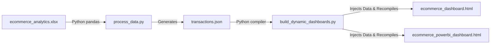

# 🛒 E-Commerce Sales Analytics Portal

<p align="center">
  
</p>

<p align="center">
  
</p>

<div align="center">

[](https://e-commerce-dashboardgit-qd3gjlse3fsulugafbvx5c.streamlit.app/)
[](https://shivam09xc.github.io/E-Commerce-Dashboard/)
[](https://www.python.org/)


📊 **Superstore Dataset · 3,500 Transactions · Interactive Analytics & Corporate Visualizations** 📈

[🌐 Live Streamlit App](https://e-commerce-dashboardgit-qd3gjlse3fsulugafbvx5c.streamlit.app/) | [🎨 Live Static Portal](https://shivam09xc.github.io/E-Commerce-Dashboard/)

---

<p align="center">
  
</p>

### ✨ A unified business analytics hub presenting two distinct frontend visual layouts of E-Commerce transaction data.

### 🚀 Explore sales trends, KPIs, profit margins, and moving average forecasts with elegant animations and premium UI effects.

</div>

---


# 🌟 Project Overview

This project is a complete **E-Commerce Analytics Dashboard Ecosystem** designed to provide deep business insights using:

* 📈 Interactive data visualizations
* 🧠 Intelligent KPI analytics
* ⚡ Dynamic filtering systems
* 🎨 Modern glassmorphism UI
* 📊 Forecasting & sales tracking
* ☁️ Cloud deployment support

The platform combines:

* **Streamlit-powered Python analytics**
* **Interactive JavaScript dashboards**
* **Power BI inspired corporate reports**
* **Real-time filtering experiences**

making it a professional-grade business intelligence portal.

---


# 🛠️ Built With & Tech Stack

<div align="center">


</div>

---


# 🚀 Key Features

## 📊 1. Interactive Chart.js Dashboard (Dark Theme)

✨ Beautiful modern dashboard with premium UI animations.

### Features:

* 🌌 Glassmorphism design system
* ⚡ Dynamic slicers & filters
* 📈 Real-time analytics updates
* 📉 Moving average forecasting
* 🎯 Revenue tracking visualizations
* 🧠 Smart KPI recalculations
* 🌙 Dark neon dashboard aesthetics

---

## 🎨 2. Power BI Styled Corporate Report

📋 Enterprise-level reporting portal inspired by Microsoft Power BI.

### Features:

* 🏢 Corporate UI layouts
* 📊 KPI delta cards
* 📌 Region-based drill-through
* 📉 Profitability analysis
* 📍 Interactive data segmentation
* ⚙️ Advanced dashboard structure

---

## 🔍 3. Streamlit Data Explorer

⚡ Powerful analytics engine built with Python & Pandas.

### Features:

* 🔎 Search engine filtering
* 📁 Dataset exploration
* 📥 CSV export functionality
* 📊 Real-time metric updates
* 🧮 Business calculations
* 📈 Interactive visual insights

---


# ⚙️ How to Run Locally

## 1️⃣ Clone the Repository

```bash
git clone https://github.com/Shivam09xc/E-Commerce-Dashboard.git
cd E-Commerce-Dashboard
```

---

## 2️⃣ Install Dependencies

Ensure Python is installed, then run:

```bash
pip install -r requirements.txt
```

---

## 3️⃣ Start the Streamlit Application

```bash
python -m streamlit run app.py
```

✅ This automatically launches the dashboard at:

```bash
http://localhost:8501
```

---


# 🔄 Data Rebuilding Pipeline

If you update transaction data in Excel sheets, rebuild the datasets using the automated processing pipeline.



## ▶️ Run Commands Sequentially

```bash
# Process Excel rows into JSON
python process_data.py

# Rebuild dashboards dynamically
python build_dynamic_dashboards.py
```

---


# ☁️ Deployment Guide

## 🌐 GitHub Pages Deployment

1. Open repository settings
2. Navigate to **Pages**
3. Select:

   * Source → Deploy from branch
   * Branch → main
   * Folder → /(root)
4. Save changes

🚀 Your static analytics portal will go live instantly.

---

## ☁️ Streamlit Cloud Deployment

1. Visit Streamlit Cloud
2. Connect your GitHub account
3. Select repository:

```bash
Shivam09xc/E-Commerce-Dashboard
```

4. Set entry file:

```bash
app.py
```

5. Click Deploy 🚀

---


# 📈 GitHub Analytics

<p align="center">
  

  
</p>

---

# 🏆 GitHub Trophies

<p align="center">
  
</p>

---

# 🐍 Contribution Snake Animation

<p align="center">
  
</p>

---

# 🌟 Future Enhancements

* 🔐 Authentication System
* 🌙 Dark/Light Theme Switcher
* ☁️ Firebase Integration
* 📱 Fully Responsive Mobile Layouts
* 📊 AI-based Forecasting
* 🧠 Machine Learning Analytics
* 🔔 Smart Notifications
* 🛒 Product Inventory Management

---

<div align="center">

# 💙 Crafted with Passion by Shivam Soni


### ⭐ If you like this project, give it a star and support the repository!


</div>
